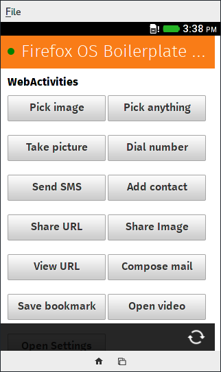

[Firefox OS Boilerplate App](https://github.com/robnyman/Firefox-OS-Boilerplate-App) ported to Dart.

## Running the app

To run the app you can simply open Firefox OS's browser and go to: [https://claudiodangelis.github.io/dart-FirefoxOS-Boilerplate-App/build/web](https://claudiodangelis.github.io/dart-FirefoxOS-Boilerplate-App/build/web) -- on top-right corner there will be a "+" button to install it.

If you want to install the app from your computer, get the code (`git clone https://github.com/claudiodangelis/dart-FirefoxOS-Boilerplate-App.git`) and learn how use Firefox's [App Manager](https://developer.mozilla.org/en-US/Firefox_OS/Using_the_App_Manager).


## Compiling the app

This code repository already has the compiled-to-Javscript version of the Boilerplate, these steps are needed only if you make some changes to the Dart code.

1. Get and install Dart => [Get Dart](https://www.dartlang.org/tools/download.html)
2. If you use Dart Editor, open the app's directory, right-click on file `pubspec.yaml` then choose "Pub Build ("generates JS")"; if you have `/path/to/dart-sdk/bin` in your $PATH, then change to app's directory and run `pub build` from the command line.


## About this porting

The Boilerplate App focuses on MozActivities and other platform-specific Web APIs,
which are not available in Dart. In order to get them working this app uses
a library for interoperating with Javascript, for example this Javascript code

```
var pick = new MozActivity({
    name: "pick",
    data: {
        type: ["image/png", "image/jpg", "image/jpeg"],
        nocrop: true
    }
});

```

in Dart becomes:

```
var pick = new JsObject(context["MozActivity"], [
    new JsObject.jsify({
        "name": "pick",
        "data": {
            "type": ["image/png", "image/jpg", "image/jpeg"],
            "nocrop": true
        }
    });
]);
```

where `context` is the JS's window object. To get more information about JS<->Dart interoperability check this article: (https://www.dartlang.org/articles/js-dart-interop/)[https://www.dartlang.org/articles/js-dart-interop/].


## For Packaged Apps

_Excerpt from the original [Boilerplate App](https://github.com/robnyman/Firefox-OS-Boilerplate-App)_

You can test packaged apps in version 2 and higher of the App Manager, by using the Add Directory button. If you want to access privileged APIs - such as deviceStorage, cross-domain XMLHttpRequest etc - you need to set type and permissions in the manifest file. E.g.

    {
        "version": "1",
        "name": "Firefox OS Boilerplate App",
        "type" : "privileged"
        …

And:

    "permissions": {
        "device-storage:pictures": {
            "access": "readcreate"
        },
        "systemXHR":{},
        "contacts": {
            "description" : "Reading out contacts",
            "access": "readcreate"
        }
    }


All options to test packaged apps are outlined in the [How to install packaged apps in Firefox OS – options and tools](https://hacks.mozilla.org/2013/03/how-to-install-packaged-apps-in-firefox-os-options-and-tools/) article

## Screenshot



## Credits

- [Robert Nyman](https://twitter.com/robertnyman) is the original creator of [Firefox OS Boilerplate App](https://github.com/robnyman/Firefox-OS-Boilerplate-App).
- [Daniele Scasciafratte](https://github.com/mte90) tested this app on his phones (Keon, Alcatel One Touch Fire), made quick fixes and designed the icon

## License

  MIT

## Author(s)
- Claudio d'Angelis - [@claudiodangelis](https://github.com/claudiodangelis)
- You! - [Fork this project](https://github.com/claudiodangelis/dart_FirefoxOS_boilerplate/fork)
